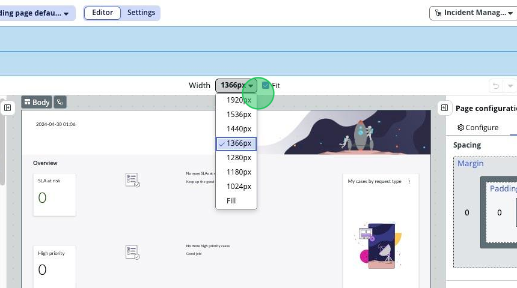
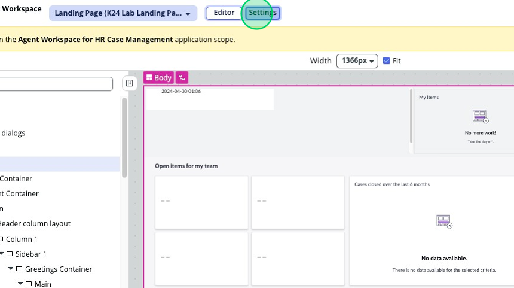

Welcome to the **Crafting Workspaces Like a Pro: A Hands-On Learning Adventure!** Lab. 

## Scenario

This lab will cover multiple real-life tasks you may be asked to accomplish for Workspaces as a ServiceNow Administrator or Developer. Through these exercises you will learn more about how UI Builder works, learn tips and tricks for working with Workspaces, and see best practices applied first hand. 

What we will cover in this lab:
- Exercise 1 - Duplicate the Variant for landing page and add a Data Visualization for HR Agent Workspace
- Exercise 2 - Create a new Dashboard page template and add it to HR Agent Workspace
- Exercise 3 - Modifying UX Lists for Service Operations Workspace
- Exercise 4 - Add a new menu item to the Plus Sign Menu
- Exercise 5 - Add a field to the Service Operations Workspace form

## Prerequisites
- **ServiceNow Version:** Washington D.C.
- **UI Builder Version:** 25.1.26
  - ** UI Builder is now a store application. If you see things different from how they are presented in the lab, check the application manager to see if you've got a pending update.
- **Plugins:**
  - HR Agent Workspace
  - Service Operations Workspace

## Download Lab Materials

- **Presentation:** [Coming soon]
- **Lab Guide PDF:** [Coming soon]

## UI Builder Exploration Walk-through

If you are unfamiliar with UI Builder, we will briefly go over the different parts that make up UI Builder. If you are familiar, feel free to skip this introduction and get started on Exercise 1.

1. Navigate to the top left corner of the filter navigator and click on **All** to open the All menu if it is not already open. 

2. Type “UI Builder” and click on the **UI Builder** menu item under the “Now Experience Framework” application menu. 

3. Once UI Builder loads in a new tab, sort the workspace experiences alphabetically and locate then click on **HR Agent Workspace**.

4. This is the Experience Editor view of UI Builder. If you are unfamiliar, take a moment to look at the different elements of UI Builder and familiarize yourself with them.

    -	In the top left corner, there is a blue and green icon. If you click on this, it will take you back to the all experiences view.
    

    -	Next to that is the title of the experience we are currently in, "HR Agent Workspace". Clicking on this will bring you to the current page, where you see the Pages and Variants for the HR Agent Workspace.
    -	Next to that you can switch between the Editor and Settings views.
    

    -	To the right, the first drop down is going to be the Application Scope selector. This is where we will select what Application Scope we are going to be working on in a few steps.
    -	The last two buttons are good for you to click on and navigate when you have a moment. What’s new will show you anything newly released within UI Builder, and the Help button contains links to useful documentation for when you get stuck.
    

    -	Below the HR Agent Workspace heading, you’ll find a menu detailing specific aspects of the experience we are currently in. You’ll see the URL Path, Application Scope, App shell, and what roles are required to view it. 
    

    -	Under “Pages and variants” you’ll find a long list with grouped items. Each gray heading is a Page in the experience, and each item under the gray heading is a variant of that page. Typically, most pages will have a “Default” page, and any variants will be listed below. Note that the variants of each page share a URL path, but the order column is what determines which shows up by default. The lowest number is the variant that shows by default, and any others below don’t show up. The next two columns govern what shows up for different users and roles. At the end of the list, you have quick access to open variants in the editor or to view the settings for the variants. You can’t edit the order, audiences, or conditions from this list view, but you can from the settings pages which we will cover later.
    

5. At the top of the list under “Pages and Variants” you’ll see the Landing Page, which can also be identified by the yellow “Landing page” tag. Click on the “Landing page default” variant. 

6. Let’s take a moment to familiarize ourselves with the UI Builder variant editor view.
    -	Below the menus we’ve already covered, you might see two blue bars telling you that this variant is Read Only, and that you can’t edit this variant. This is by design, as any OOB pages and variants will be Read Only by default. You must duplicate a variant to be able to make modifications to it. This is also where you would see a message telling you that you are in the wrong scope to edit a variant if that were the case. 
    

    -	The next menu bar that you see will contain a hamburger menu (three horizontal lines) in the top left, providing you quick links to Duplicate a variant and other useful developer options/links. If you were on a page that had any URL parameters, you would be able to input test data for them next to this menu bar. 
    

    -	There is also a setting to change the width of the variant preview in the Stage panel, as well as some handy options in the top right. We’ve got an undo and redo button, a preview button, and a save button. We will go over the preview button later, but for now, don’t forget where the save button is – it’s super useful!
    

7. Below that menu bar, you have the three main sections of UI Builder.
    -	Component tree: The component tree is split into two sections. You’ve got the Overlays section at the top that contains any modals, modeless dialogs and popovers that are in the page. Then you’ve got the Body section, which encompasses everything you see on the page variant. There are containers and components within containers among many other things. If you notice any with a crossed-out eye, that means that they are currently not visible and are being hidden by a condition. You can tell that it gets a bit cluttered and confusing, so we always suggest you rename your containers and components to maintain ease of use and clarity. We’ll go over how to do this later.
    

    -	Data and scripts: This section has been changed as of Washington. It is now resizable and contains all your Data Resources, Client Scripts, and Client State Parameters. If you click on any of these, a new modeless dialog box will pop up and allow you to work on the item you selected while being much more flexible than it used to be. Now you can move it around, resize it as needed, and then close it when you are done working on it. Just in case it’s your first time in UI builder, here’s a quick introduction to these three data components and links to where you can learn more about them:
    

      a.	Data resources: The mechanism you use to bring data from your tables to your pages in UI builder.
      b.	Client state parameters: Imagine these are the scratchpad variables available to your page. You can create as many as you need.
      c.	Client scripts: Client-side scripts can be created here and accessed by your page.
      

    -	Stage panel: The page variant itself is displayed here, reflecting what it might look like when browsed by an end user. If you have test data in your URL parameters setting, then the stage panel might change accordingly. 
    

    -	Page/Component Configuration Panel: This is the most important part of UI Builder. Here you will find all of the configuration options for components and pages. As you work with getting familiar with UI builder you'll find yourself coming here very often to make modifications. 
    

    It consists of three tabs: 
            - Configure: This is where all of the configuration options for pages and components live.
            

            - Styles: This is where you will find all styling options for components and pages.
            

            - Events: This is where you will be able to create and modify event mappings and event handlers.  
            

8. In the top right corner, we see the “Save” button. You’ll want to get in to a habit of doing this routinely to safeguard your progress.
9.	Next to the “save” button is the “Preview” button with a dropdown arrow. The dropdown opens to show you the “Open URL path” option. If you click on Preview, a modal will pop up that shows you a rendered preview of the current variant you are editing. This allows you to preview the variant you are currently on without having to impersonate a user who has access to see it via audiences and conditions. Alternatively, if you click on the dropdown arrow and select “Open URL path” – this will display the variant that the user you are logged in as would see according to audiences, conditions, and the order of the variants.

10.	If you go to the settings menu in the top center of the page, you will see in the top left all the page variants for your page and what order they are in. The left menu reflects the order of variants, and according to any conditions or audiences that may be applied, they will generally be shown to you in top-to-bottom order. If your users can’t see a specific variant, make sure to verify all conditions and audiences are met, as well as that the variant in question is the one at the top of the list from the variants they have access to. 

Now that you are familiar with the basic structure of UI Builder, you are ready to begin the lab. 