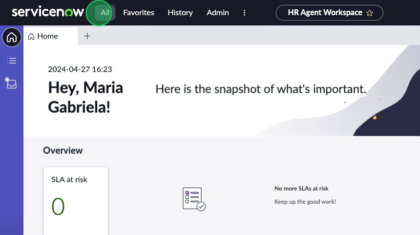

## Overview
In this activity, you will learn how to duplicate a variant in UI Builder and change its order.

## Instructions

1.	Navigate to HR Agent workspace by going to the Unified Navigator menu, clicking on the **Workspaces** drop-down menu, and clicking on **HR Agent Workspace**.

2.	Here you can see the default landing page of the workspace.. Take a quick moment to familiarize yourself with the different sections and the requirements we have been given in the scenario.

3.	Navigate to the top left corner of the filter navigator and click on **All** to open the All menu. 

4. Type “UI Builder” and click on the **UI Builder** menu item under the “Now Experience Framework” application menu. 

5.	Once UI Builder loads in a new tab, sort the workspace experiences alphabetically and locate then click on **HR Agent Workspace**.

6.	This is the Experience Editor view of UI Builder. If you are unfamiliar, take a moment to look at the different elements of UI Builder and familiarize yourself with them using the UI Builder walkthrough in the overview of this lab.
7.	At the top of the list under “Pages and Variants” you’ll see the Landing Page, which can also be identified by the yellow “Landing page” tag. Click on the **Landing page default** variant. 

8.	Before you start any work, it’s important that you always make sure you are in the correct application scope. In the top right corner, select the Application Scope drop-down menu and switch to the **Agent Workspace for HR Case Management** scope.

9.	In the top left corner, click the **hamburger menu** then click **Duplicate variant**. 

Let’s quickly explain what you are looking at:
    -	Audiences: These are representations of groups of users in your organizations. These let you define who has access to these pages, If you leave it blank anyone with access to the page will have access to the variant. 
    -	Conditions: These can be used to determine when a page variant is shown. Conditions are based on adding a query string that sets the criteria that must be met for the page variant to display. 
10.	Rename the variant to “K24 Lab Landing Page” and click **Create**.

1.  You will automatically be redirected to the new variant.
12.	In the top left area, click on **Settings**.

1.  On the left side you'll see the Page Variants. Right now, all of the variants are listed at order 0 since we just duplicated them. 

1.  Click on the **K24 Lab Landing Page** variant. 
2.  Set your K24 Lab Variant to order **10**.
    

3.  Click **Save**.

1.  Set the “Landing page default” variant to order **100**. 

1.  Click **Save**.

:::note
This will ensure that when you click “Open URL path”, the variant you see is the variant we are editing. 
:::
