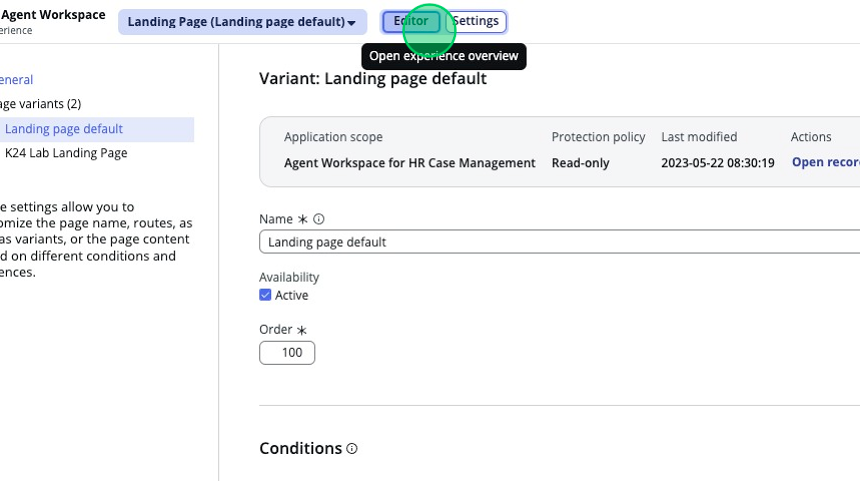
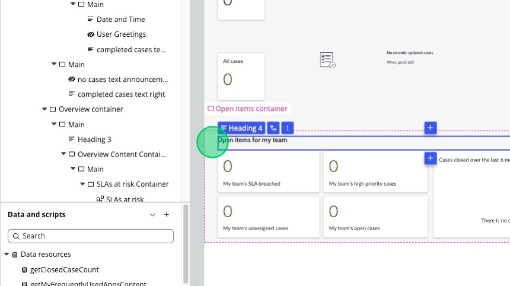
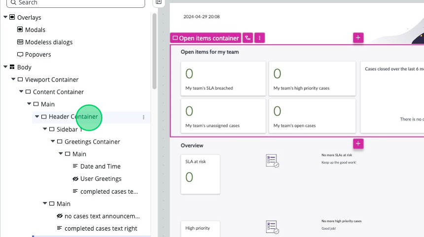
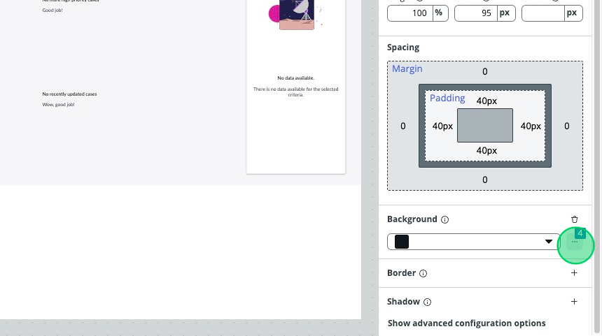
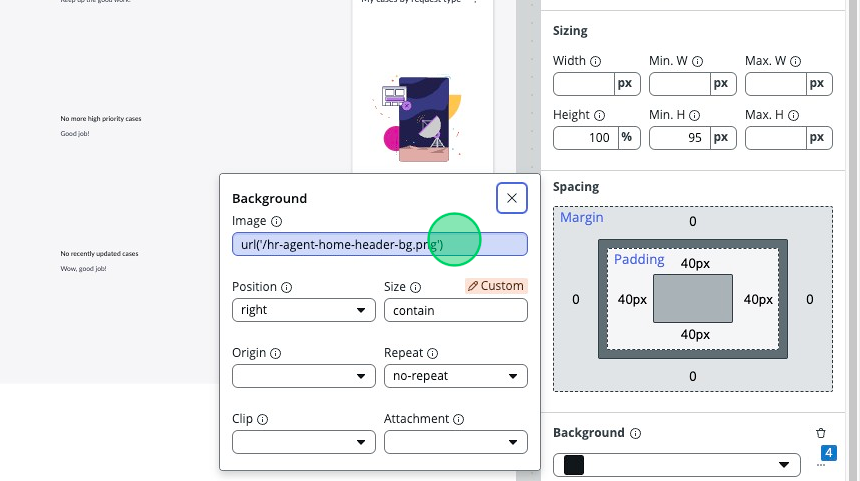
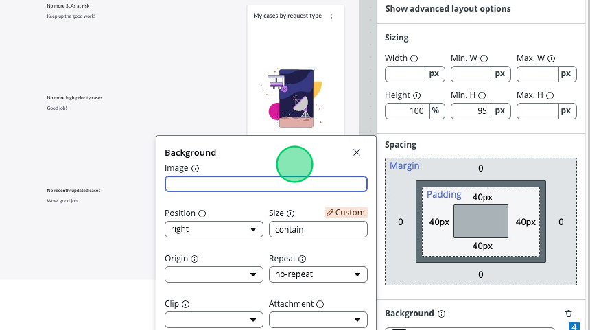
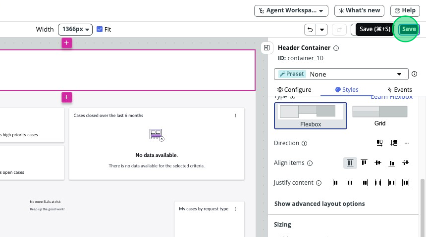

## Overview
In this activity, you will learn how to move containers and components around in UI builder.

## Instructions

1. Click back on the "K24 Lab Landing Page" and navigate to the UI Builder **Editor**.
   

2. With Washington, the page preview has gotten a lot more interactive. Hover your mouse above the “Open items for my team” section and click on the **Open items container**.  Click and hold, then drag the container above the “Overview container”. 

:::note
Alternatively, you can also drag and drop items in the Component tree itself. Locate the “Open items container” in the list, collapse the “Overview container” above it by clicking on the arrow to the left, and then click, drag & drop the “Open items container” heading above the “Overview container”. You will see the stage to the right update in real time when you let go of the heading.
:::

:::info
The remaining steps will assume that you have chosen to navigate this page using the Content tree, but you can navigate using the stage pane if you wish to.
:::

3.	Scroll up to the top of the content tree and select the **Header Container**. The Component configuration panel will update to show this container’s properties. 

4. Scroll down to the bottom and under “Background” click on the **three dots** with a blue box containing the number “4” hovering above it. 

5. Here you will see the expanded background options. Remove the image information by selecting and erasing the entire text inside the “image” box. 
:::note 
Alternatively, you can click on the trash can in the original “Background” section of the Component configuration panel. This will remove all configuration inside the Background options.
:::

6.	In the top right corner, click on the “Save” button. 

Note: You can also click CTRL + S or Command + S to save!