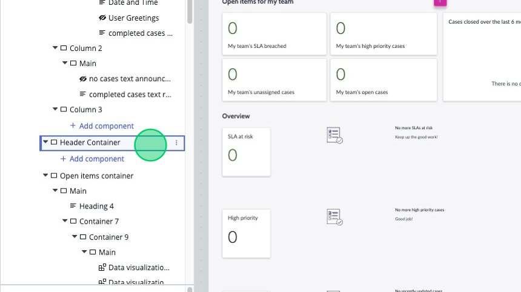

## Overview
In this activity, you will replace the Header container with a new Columns layout component. 

## Instructions
1.	Start in the Editor view of UI Builder.
2.	To add the Columns layout component, right-click the “Header container” and select **Add before**. A pop-up will appear listing out Layouts and Components. 

3. Click on the **Layouts** tab at the top left of the pop-up, it displays a number of different layout configurations you can pick from. 

4. Select the **Three columns** configuration. You will now see that a “Column layout 1” component was added above the “Header container” in both the stage and the Component tree panel. 

5.	Select the **Column Layout 1** component in the the component tree.

6. At the very top of the Component configuration panel, you will see the Name and ID of the component we’ve got selected. Click on the little (i) icon next to the component name. This will show the pop-up where you can set the Component’s Label and ID. 

:::info
It’s always a good idea to rename your components so they are easier to identify in the future.
:::
7. Rename this column layout to “Header column layout” and set the id to “header_column_layout”.

8. Click **Apply.**

9.	**Click and drag** the “Sidebar 1” container from the old “Header Container” to our new column layout under “Column 1”. 

10.	**Click and drag** the “Main” container from the old “Header Container” to our new column layout under “Column 2”.

11.	Now that the old Header Container is empty, right-click it from the component tree panel and click **Delete**.

12. This is what the new Header column layout hierarchy should look like:
