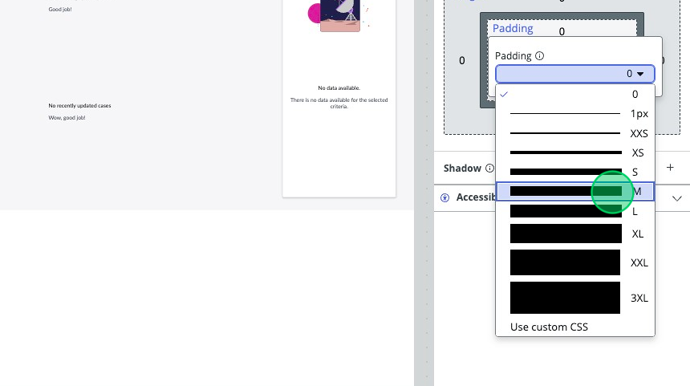

## Overview
In this activity, you will make modifications to the column layout component and the columns inside.

## Instructions
1. Click on the **Header column layout** component in the Component Tree.

2. This should show the Component configuration in the right most panel.
3. Expand "Background" by pressing the **plus**.

4. Using the dropdown, select **Surface neutral 2**.

5. Expand "Spacing" by pressing the **plus** if it's not already expanded.

6. Add padding by clicking on **Padding** and selecting **M**.

7. We're going to make a quick change to the "User Greetings" component. Select it from the component tree. 

8. You’ll see it’s currently being populated by a Client State Parameter, we’re going to change this using the new Visual Data Binding formulas. 

9.  Click on the **input box** below “Text” and it will show the “Bind data to Text” window. 
10. Click on the data pill at the box.
11. Click the X next to the data pill to remove it from the data output box.
12. 
13.	On the left side, click on **Formulas**

 
14. Click on **Popular**.

15. Click on **CONCAT**.

16. Click the **up arrow** next to “CONCAT” to bring that formula up to the data output box.

17. Inside the formula at the top, click on **Value 1**.

18. Type: `“Hello and Welcome “` (include the quotes and the space at the end, you might need to double-click to get the empty box to show up).

18.	Click on the second **Values** box.

19. Click **Data Types** on the left.

20. Click **Page** **properties**.

21. Click **Session**.

22. Click **User**.

23. Click **firstName**.

24. Click the up arrow that appears next to the `firstName` pill to add it to the formula builder.

25.	Click **Apply**.

27.	Under the “Main” container in the content tree, move the **Date and Time** component below the **User greetings** component. 

28. Click **Save**.
