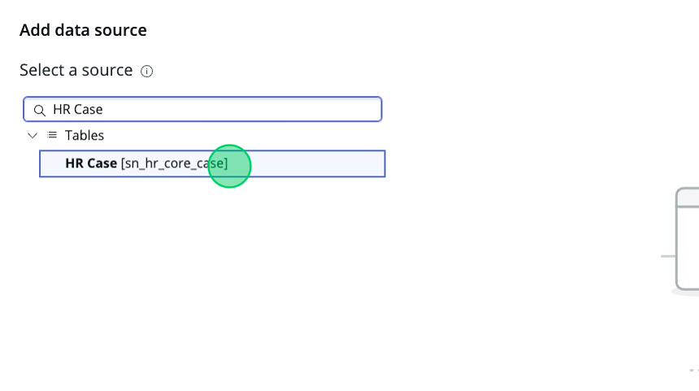

## Overview
In this activity, you will create a Data Visualization and add it to the page. 

## Instructions
1.	Right click on the "Column 3" component in the component tree.

2. Click **Add Component**.

3. Select the **Data Visualization** component.

4. On the right, in the Component Configuration panel, change the name and ID.
    1.  Name: My Items Data Viz
    2.  ID: my_items_data_viz

5.  Click **Apply**.

6. Under "Data visualization type", select **Semi Donut** from the options provided.

7. Expand "Header and border" by clicking the down arrow.

8. Set the Chart Title to "**My Items**".

9.  Expand "Data" by clicking the down arrow if it's not already expanded.

10.  Click the **Add a Data Source** button.

11.  In the top left corner, click on the "Search sources" input box.

12.  Type "HR Case".
13.  Under the "Tables" category, select `HR Case [sn_hr_core_case]`.

14. Click **Add custom conditions**.

15. Fill in the condition editor as follows:
    1.  Select Field: **Assigned to**

    2.  Select Operator: **is (dynamic)**

    3.  Enter Value: **Me**

16. Click **Add this source** at the bottom right of the page.

17. Expand "Group by" by clicking the down arrow if it's not already expanded.

18. Click the **pencil icon** next to "Active"

19. Click the "Field for HR Case" **dropdown**.

20. Type "State" in the search bar.
21. Click on the **State** option.

22. Click **Apply**.

23. Expand "No data message" by clicking the down arrow.

24. Toggle the "Set custom message when no data" field.

25. Change the "Heading" to say: "No more work!"

26. Click **Save**.
