## Overview
In this activity, you will create a Platform Analytics dashboard for us to use later in this exercise.

## Instructions

1. Navigate to the Platform Analytics Center by going to the platform view and typing in "Platform Analytics" in the Filter Navigator.
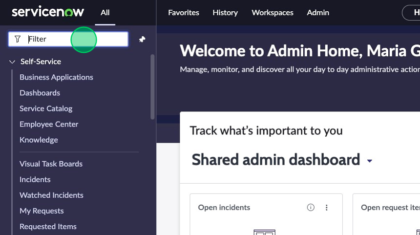
2. Click on **Analytics Center**.
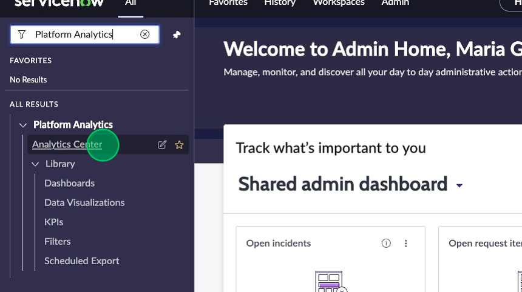

3. Click on **Create new dashboard**
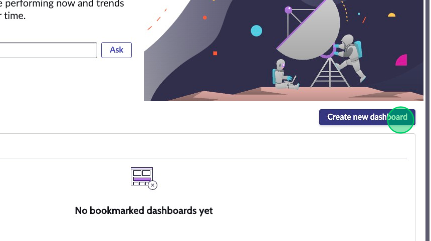

4. Select **In-line editor**.
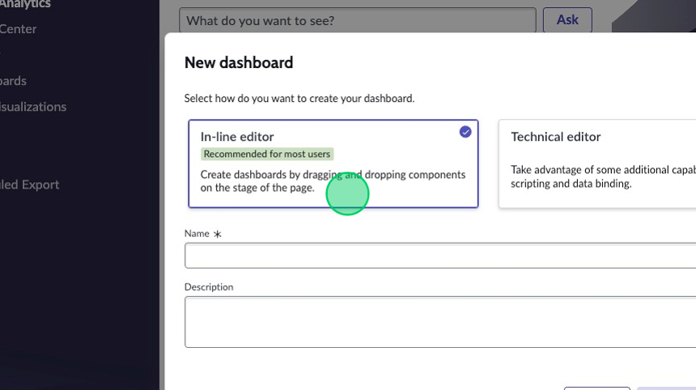

5. Name it "K24 Lab Dashboard".
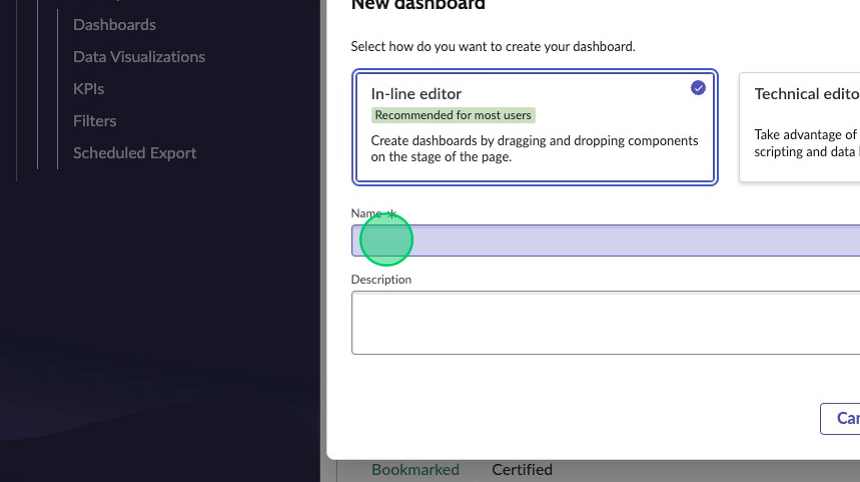

:::note
In the future, try out the Technical editor for a more in-depth dashboard creation experience. You should also check out the [Platform Analytics Academy](https://www.servicenow.com/community/platform-analytics-articles/2023-platform-analytics-academy-sessions/ta-p/2440869) for more information on the Platform Analytics Center. 
:::

6. Click **Create new dashbboard**.
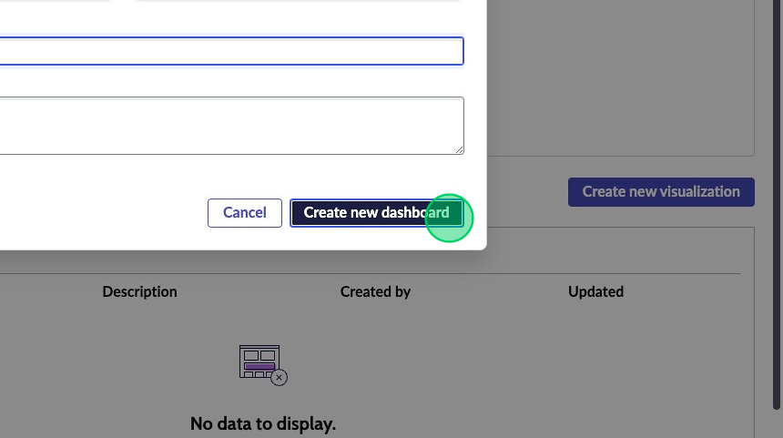

7. In the top right corner, click **Add new element**.
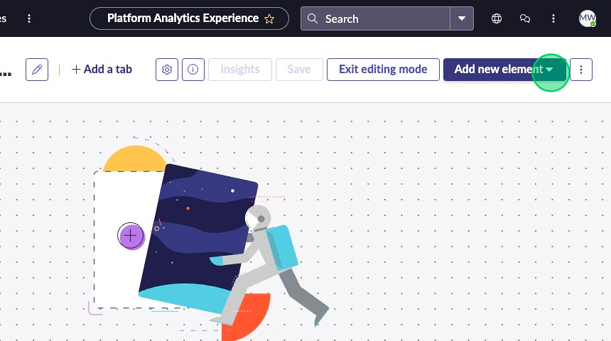
8. Select the **Heading** component.
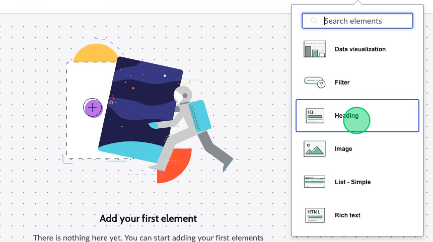

9.  Change **Style** to "Header-hero".
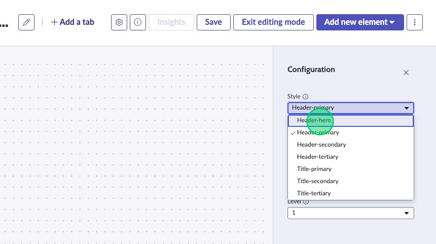

10. Change **Label** to: "Knowledge 2024 - Lab Dashboard".
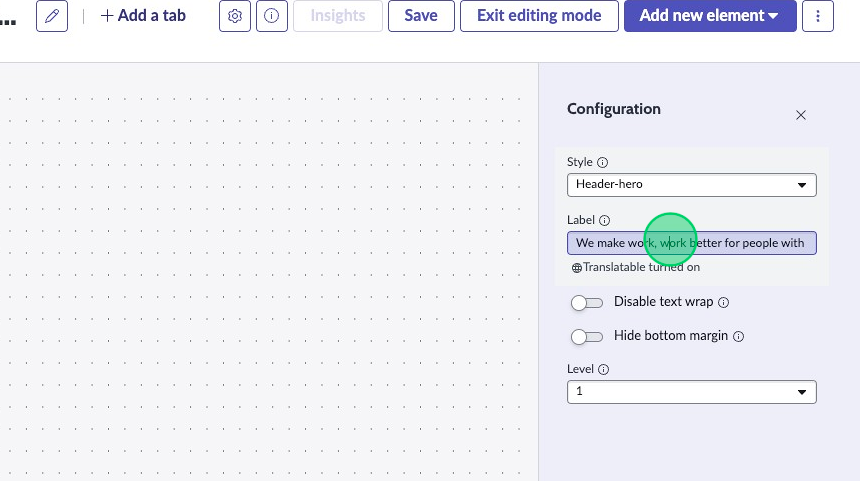

11. Stretch out the header across the entire page by clicking on and dragging the bottom right corner of the component in the preview.
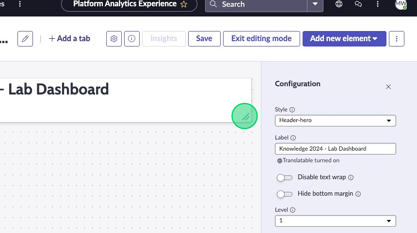

12. Click on **Add new element**.
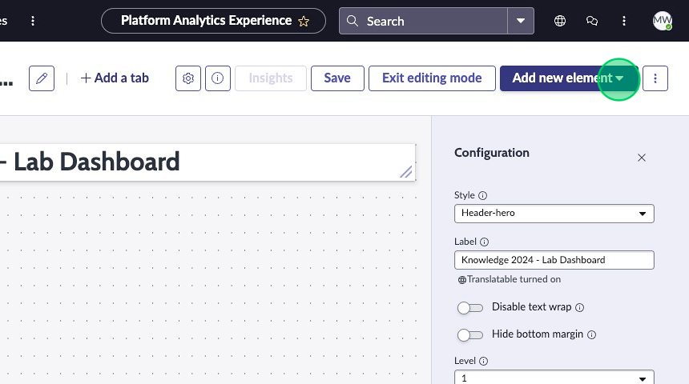

13. Click **List - simple**.
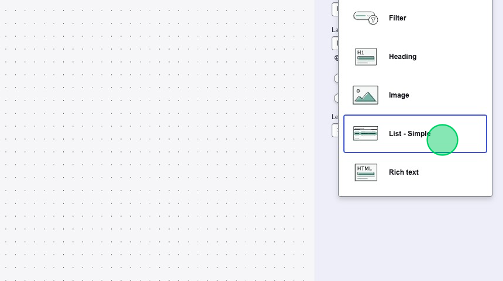

14. Fill in the Table field in the Configuration panel with: HR Task [sn_hr_core_task]
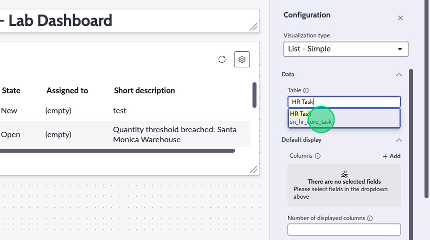

15. Click **Save**.
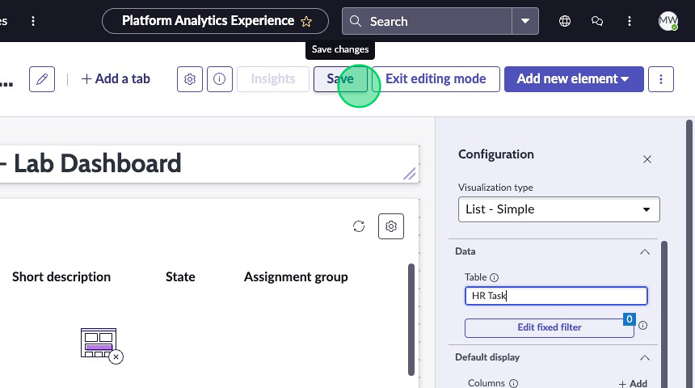

