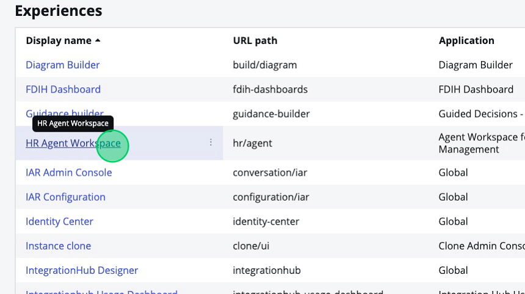
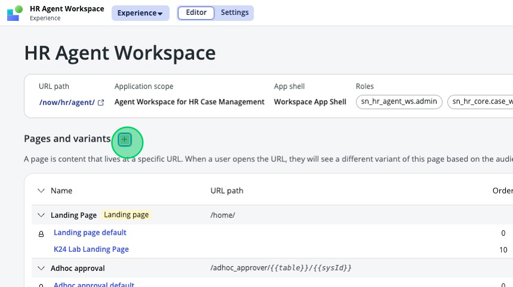
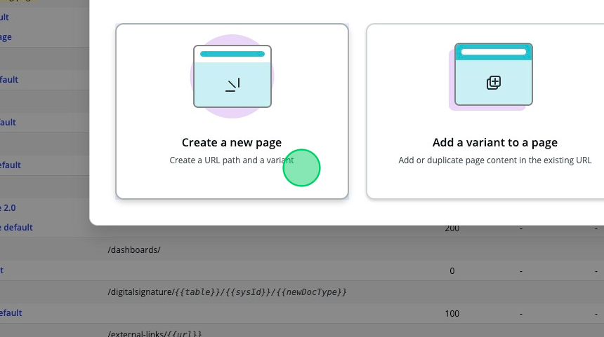
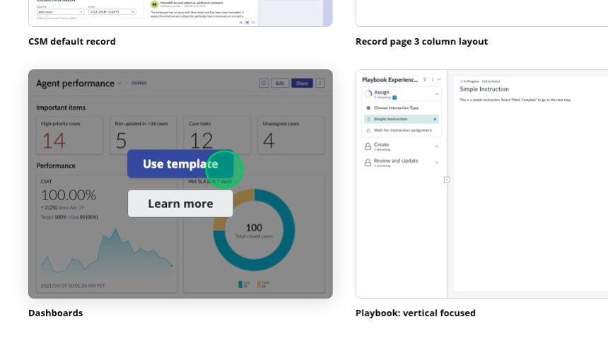
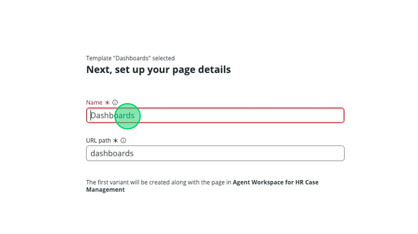
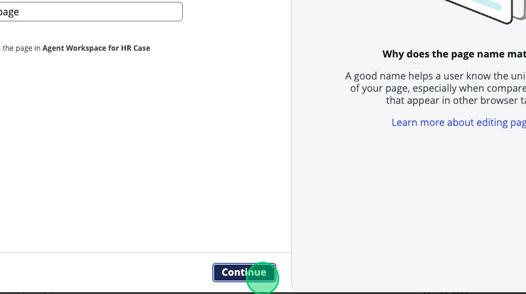
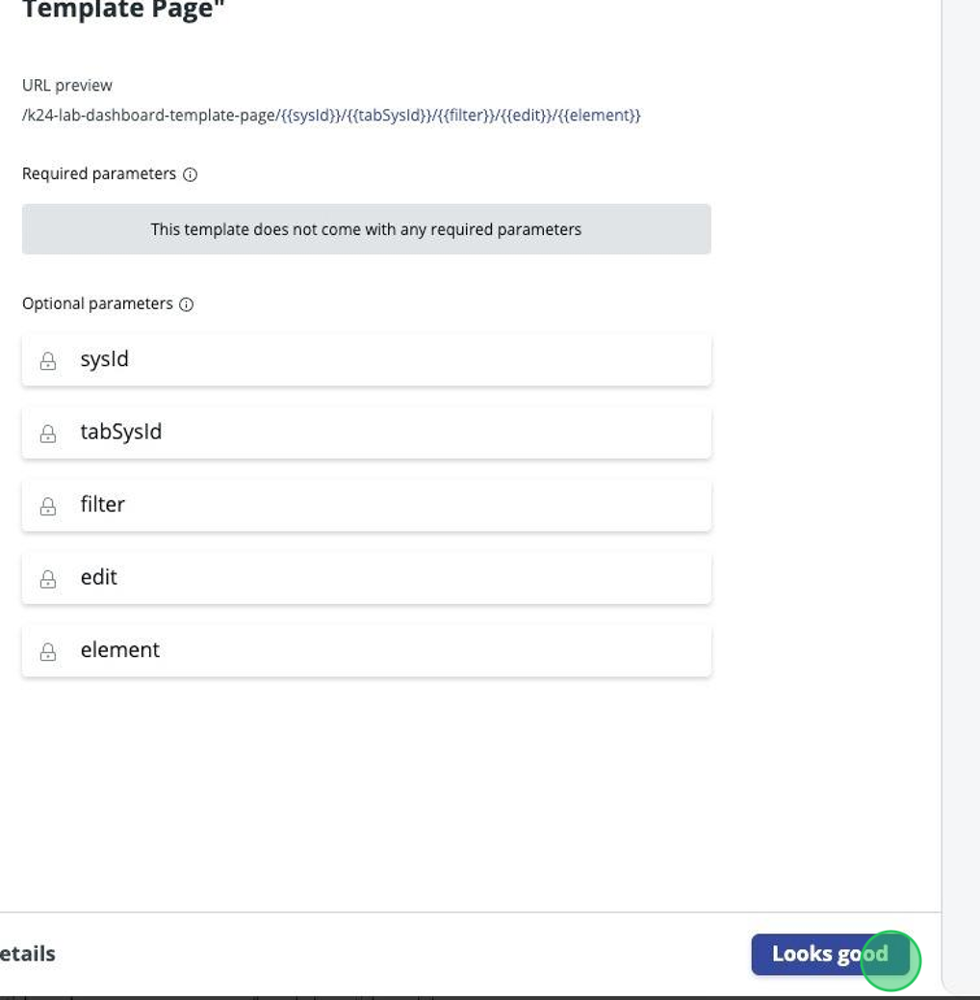
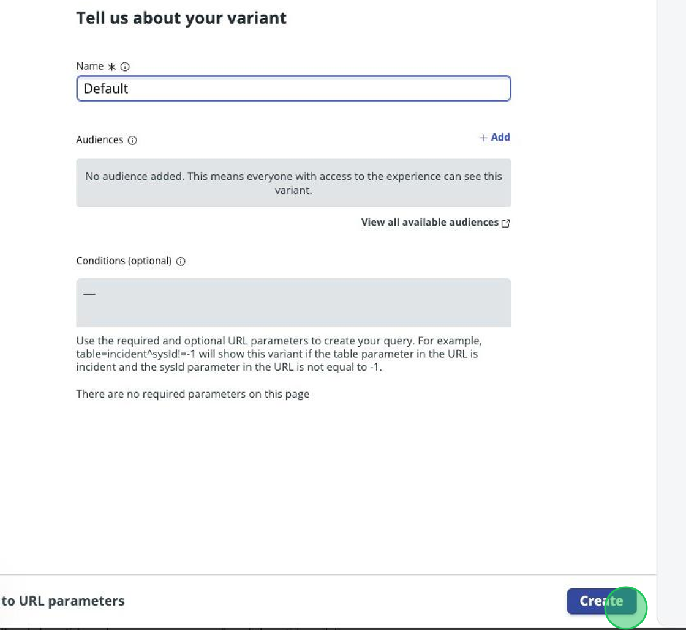

## Overview
In this activity, you will create a new page in UI Builder for the HR Agent Workspace. 

## Instructions

1. Starting in UI Builder home page, locate the **HR Agent Workspace** record.

2. Next to "Pages and variants", click the **Plus button**.

3. Click **Create a new page**.

4. Scroll until you find the "Dashboards" template and hover your mouse over it.

5. Click **Use template**.

6. Click the "Name" field input box.
7. Type: "K24 Lab Dashboard Template Page"

8. Click **Continue**.

9.  We aren't going to change anything in this page, Click **Looks good**.

10. We're presented with options to create the default variant to the page; we don't need to change anything here either. Click **Create**.

11. Congratulations, you've created your page!
