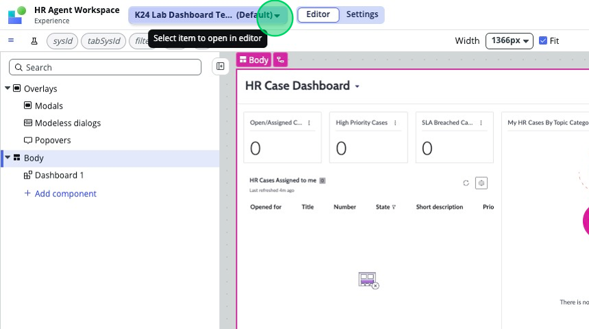
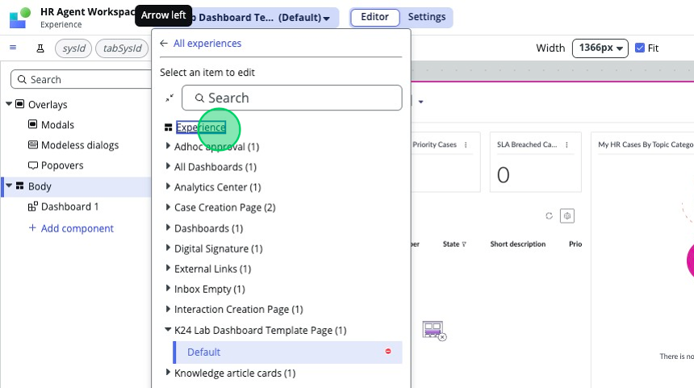
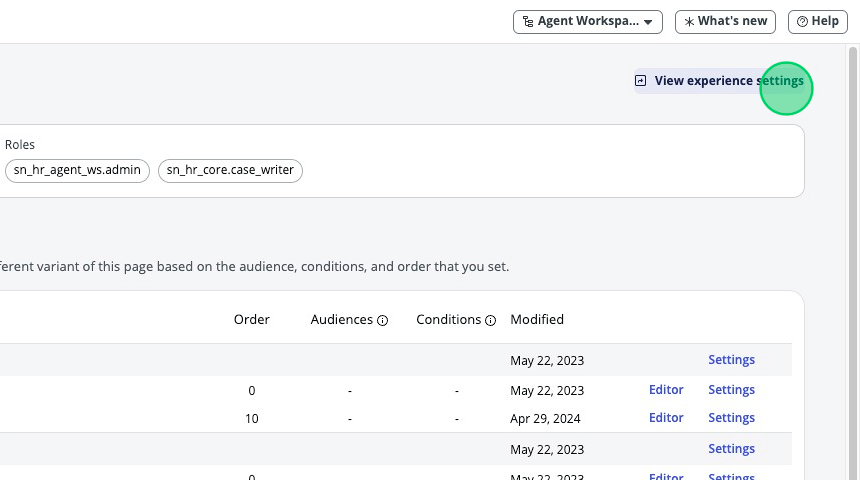
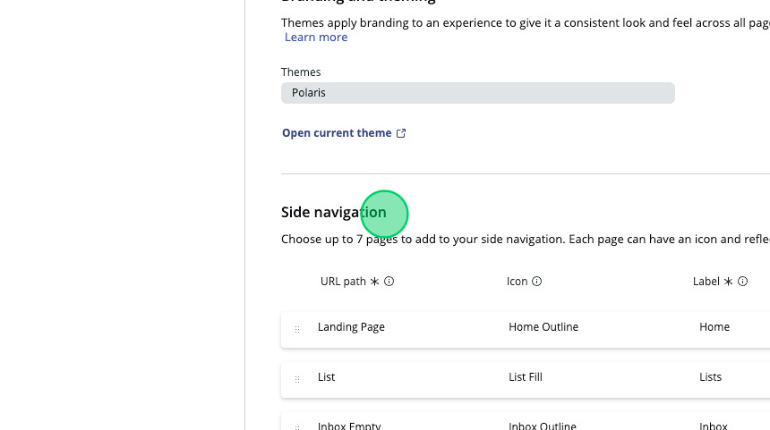
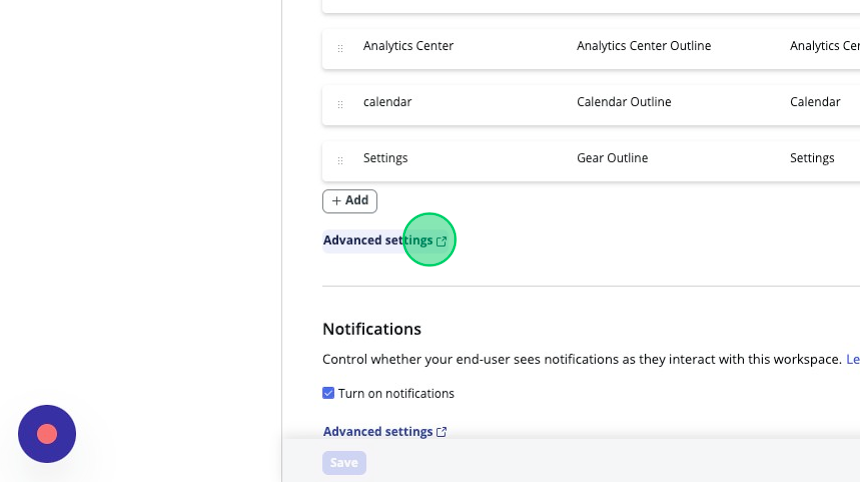
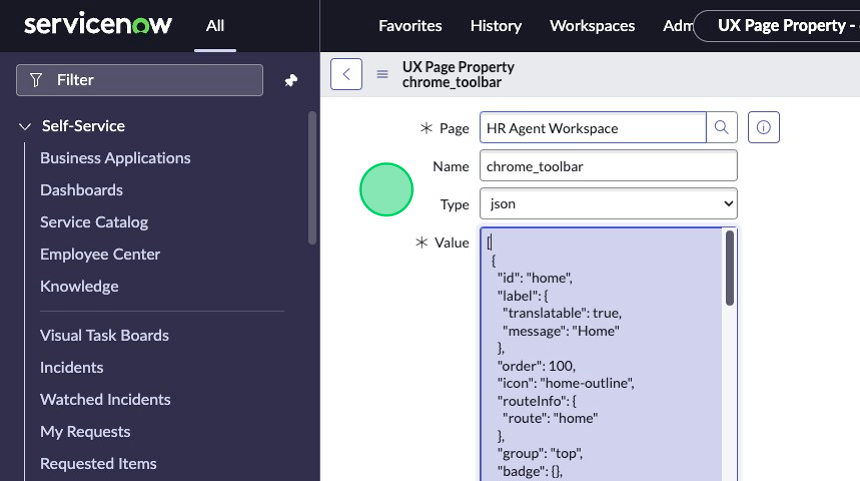
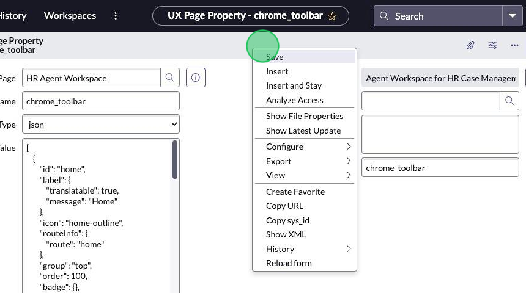
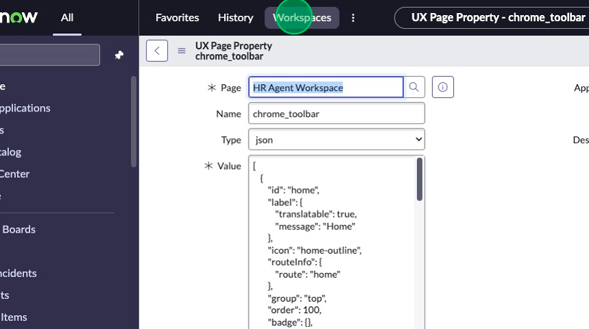
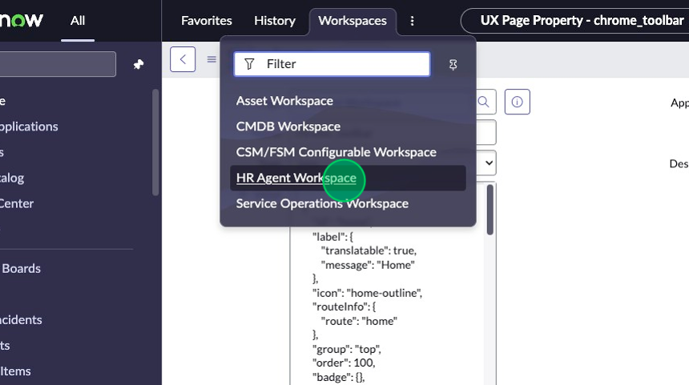
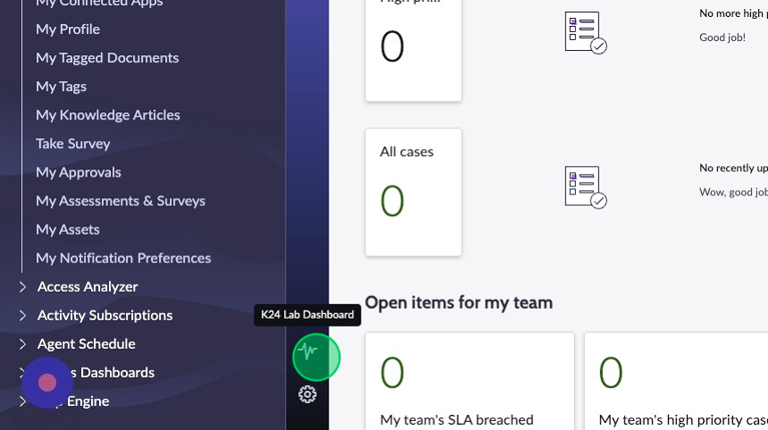

## Overview
In this activity, you will add the new page you created in the previous activity to the L1 menu. 

## Instructions

1. In the top left corner, click on the dropdown with the name of the page you are currently on.


2. Click **Experience**.


3. In the top right corner, click **View experience settings**.


4. Scroll down to "Side navigation".


5. Click on **Advanced settings**.


6. This record is the UX Page Property record titled `chrome_toolbar`. The JSON in the `value` field controls the L1 menu.


7. Replace the JSON with the code below:
```
[
    {
        "id": "home",
        "label": {
            "translatable": true,
            "message": "Home"
        },
        "icon": "home-outline",
        "routeInfo": {
            "route": "home"
        },
        "group": "top",
        "order": 100,
        "badge": {},
        "presence": {},
        "availability": {},
        "viewportInfo": {}
    },
    {
        "id": "list",
        "label": {
            "translatable": true,
            "message": "Lists"
        },
        "icon": "list-fill",
        "routeInfo": {
            "route": "list"
        },
        "group": "top",
        "order": 200,
        "badge": {},
        "presence": {},
        "availability": {},
        "viewportInfo": {}
    },
    {
        "id": "inbox",
        "label": {
            "translatable": true,
            "message": "Inbox"
        },
        "icon": "inbox-outline",
        "routeInfo": {
            "route": "inbox"
        },
        "group": "top",
        "order": 300,
        "badge": {
            "count": 0
        },
        "presence": {
            "status": ""
        },
        "availability": {
            "roles": [
                "awa_agent"
            ],
            "plugin": "com.glide.interaction.awa"
        },
        "viewportInfo": {
            "route": "inbox-sidebar",
            "fields": {
                "opened": false
            },
            "viewportElementId": "wsInboxSidebar"
        }
    },
    {
        "id": "analytics-center",
        "label": {
            "translatable": true,
            "message": "Analytics Center"
        },
        "icon": "analytics-center-outline",
        "routeInfo": {
            "route": "analytics-center"
        },
        "group": "top",
        "order": 400,
        "badge": {},
        "presence": {},
        "availability": {
            "roles": [
                "pa_viewer"
            ],
            "plugin": "com.sn_hr_pa"
        },
        "viewportInfo": {}
    },
    {
        "id": "calendar",
        "label": {
            "translatable": true,
            "message": "Calendar"
        },
        "icon": "calendar-outline",
        "routeInfo": {
            "route": "calendar"
        },
        "group": "top",
        "order": 500,
        "badge": {},
        "presence": {},
        "availability": {
            "roles": [
                "sn_shift_planning.agent"
            ],
            "plugin": "com.sn_hr_wfo"
        },
        "viewportInfo": {}
    },
    {
        "id": "settings",
        "label": {
            "translatable": true,
            "message": "Settings"
        },
        "icon": "gear-outline",
        "routeInfo": {
            "route": "settings"
        },
        "group": "bottom",
        "order": 900,
        "badge": {},
        "presence": {},
        "availability": {
            "roles": [
                "sn_hr_core.admin"
            ]
        },
        "viewportInfo": {}
    },
    {
        "id": "k24-lab-dashboard-template-page",
        "label": {
            "translatable": true,
            "message": "K24 Lab Dashboard"
        },
        "icon": "activity-fill",
        "routeInfo": {
            "route": "k24-lab-dashboard-template-page"
        },
        "group": "bottom",
        "order": 600,
        "badge": {},
        "presence": {},
        "availability": {},
        "viewportInfo": {}
    }
]
```   
:::note
Of note, one of the fields we provided as part of the JSON can be described as follows:

`id` and `route` both point to the ID of the page - in this case `k24-lab-dashboard-template-page`. You can find this in the list of pages in the experience view of the workspace. 
:::
8. Right-click the header and click **Save**.


9.  Navigate back to the HR Agent Workspace by clicking on the **Workspaces** menu item.


10. Click **HR Agent Workspace**.


11. Your new menu item should be displaying in the bottom left corner, above the gear icon.

