## Overview
In this activity, you will navigate to the correct list configuration for the Service Operations Workspace list page.

The customer has asked us to re-organize the list menu so that the “Incidents” category is moved between “Interactions” and “Requests”. They also want us to add a brand new list within the “Incidents” category.

## Instructions

1. Navigate back to the home page of your instance.
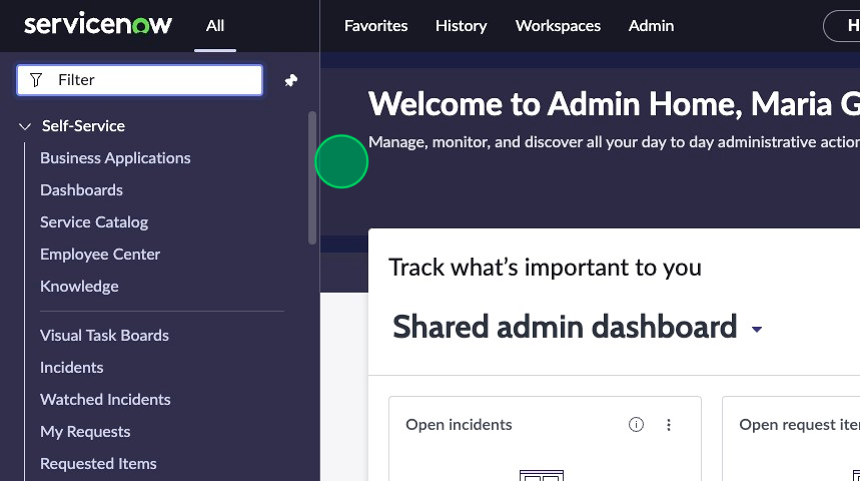

2. Switch to the scope "Incident Management for Service Operations Workspace".
   1. Click the globe icon in the top right corner of the page 
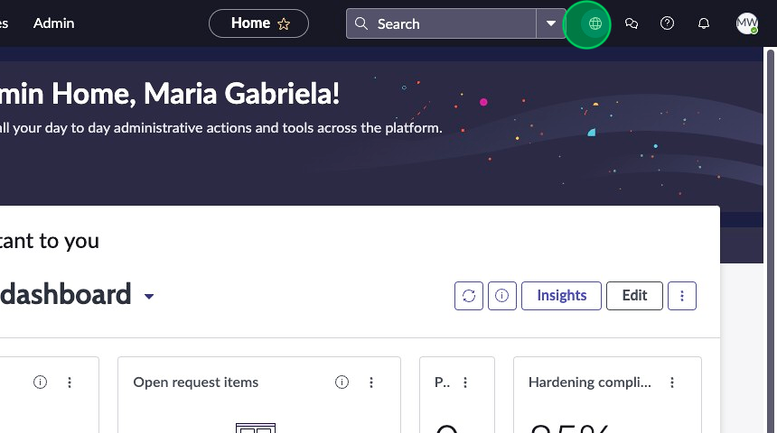

   2. Expand “Application scope” 
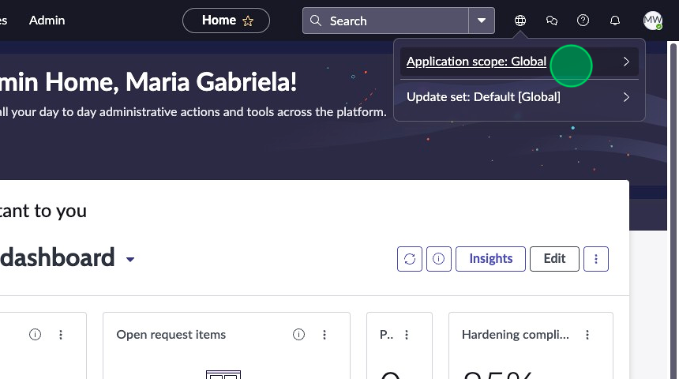

   3. Type “Incident ma” in the filter 
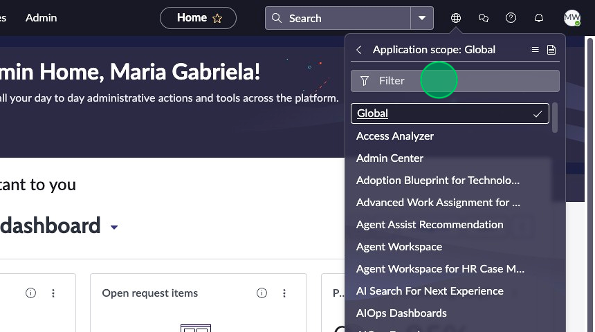

   4. Select “Incident Management for Service Operations Workspace”
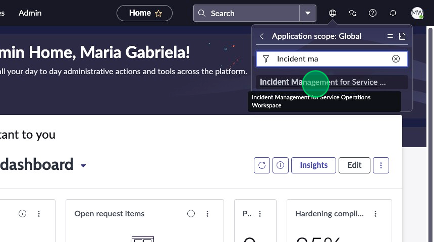

:::note 
You can also switch scope from within UI Builder by clicking the dropdown in the top right corner, to the left of “What’s new” 
:::
3. Click on the **Workspaces** menu item.
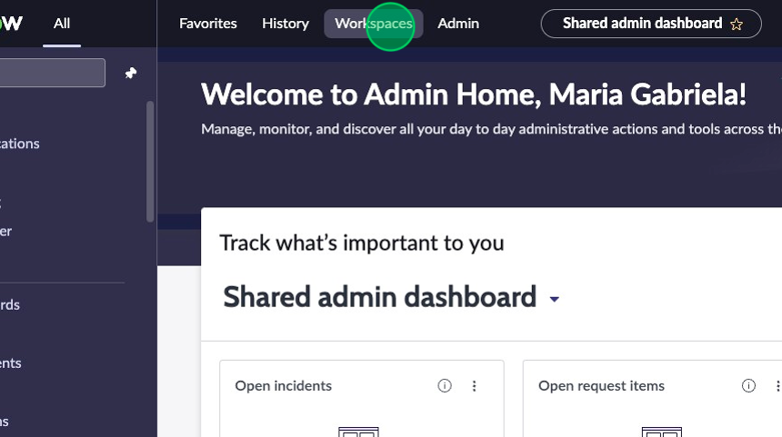

4. Select the **Service Operations Workspace** option.
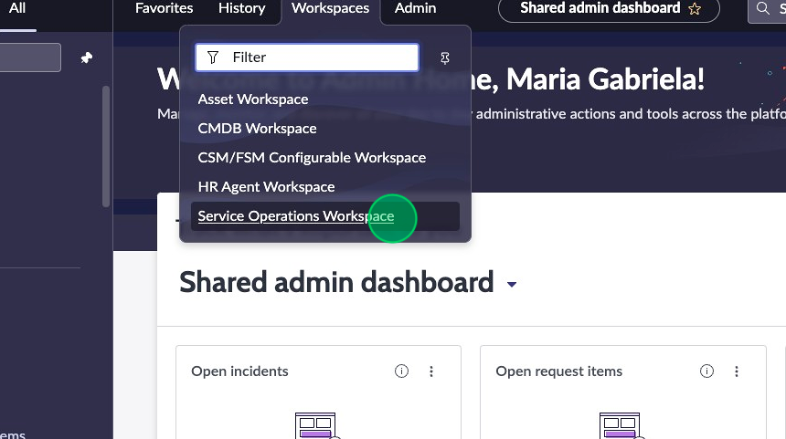

5. Click on the **list icon** in the L1 menu on the left. This is what we are going to be working to modify in this exercise.
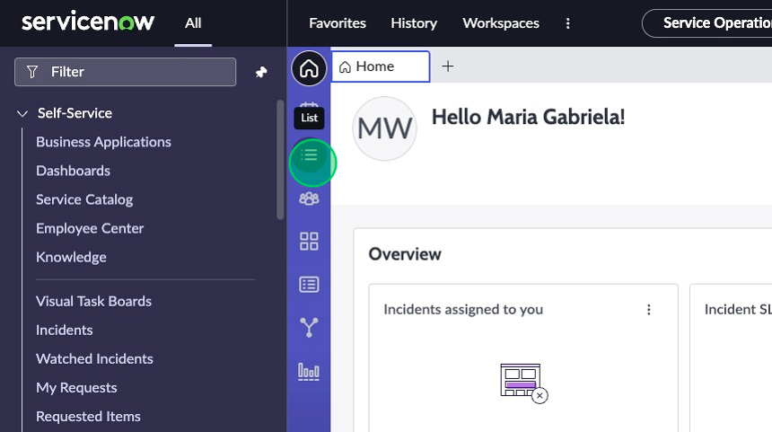

6.	Navigate to the top left corner of the filter navigator and click on **All** to open the All menu if it is not already pinned. 
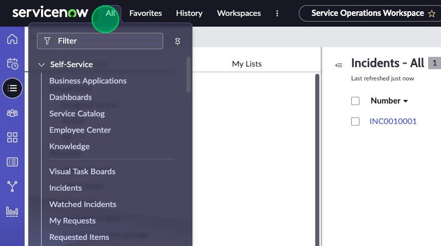

7. Type “UI Builder” and click on the **UI Builder** menu item under the “Now Experience Framework” application menu. 
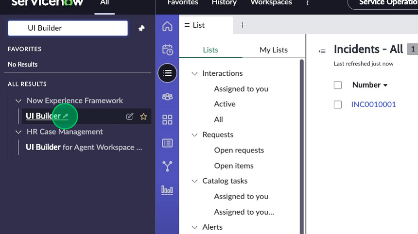

8.	Once UI Builder loads in a new tab, sort the workspace experiences alphabetically and locate then click on **Service Operations Workspace**.
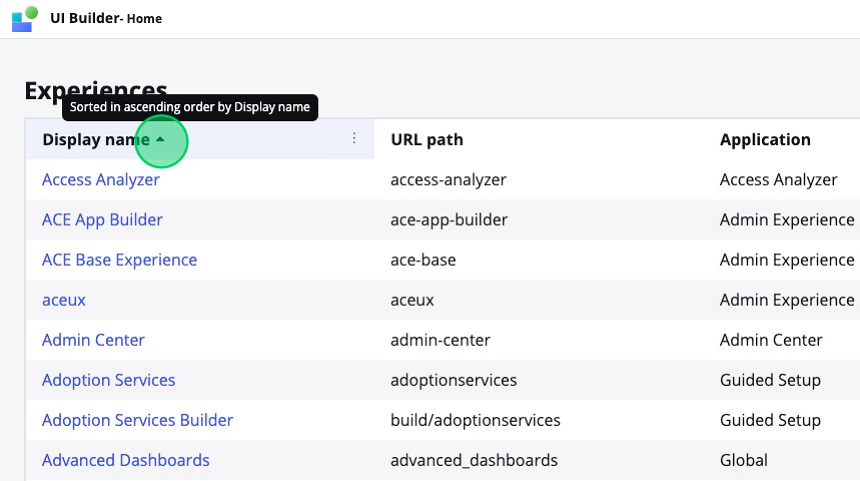
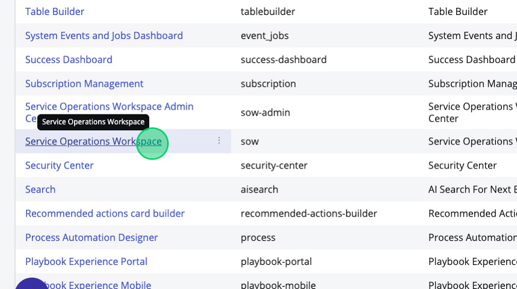

9.	Find the "List" page.
10. Click the default variant titled **List SNC**.
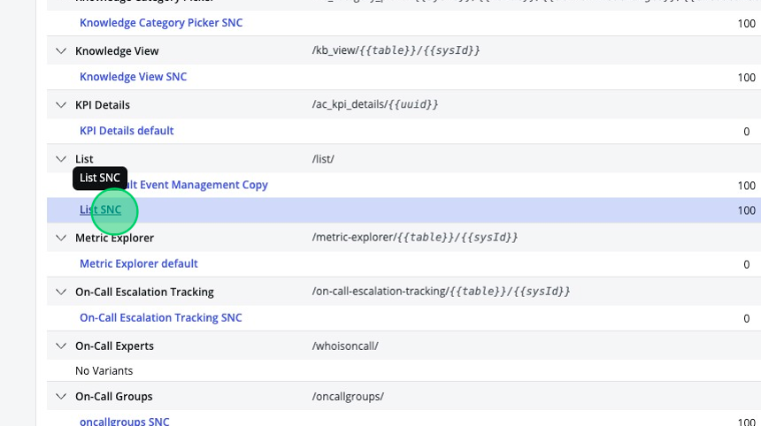

11. On the left side of the page, you’ll see the Content panel. In the content tree, click on the “List nav” component.
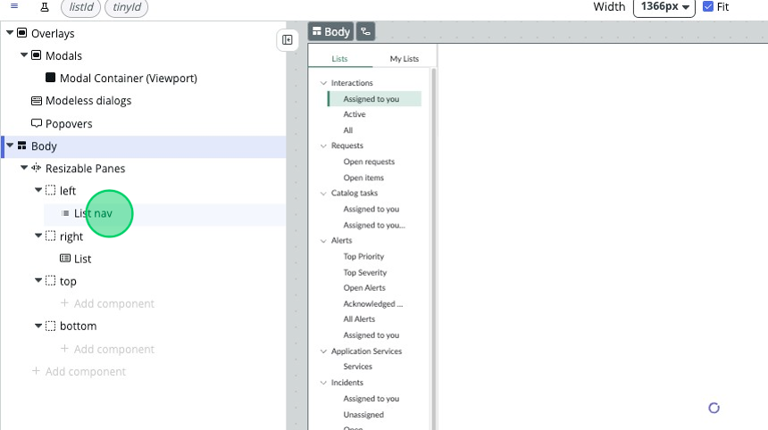

12. Check out the config panel on the right side of the UIB page. This is where each component can be configured by setting its properties, styles, and events. Select the **Configuration** link at the bottom. This will open the UX List Menu Configurations table in a new tab.  
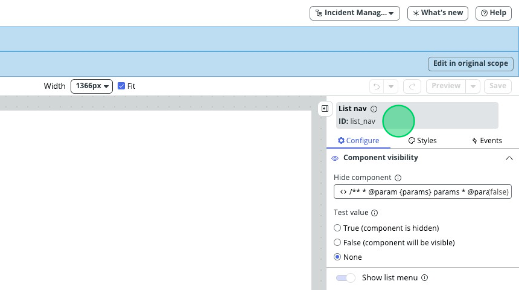
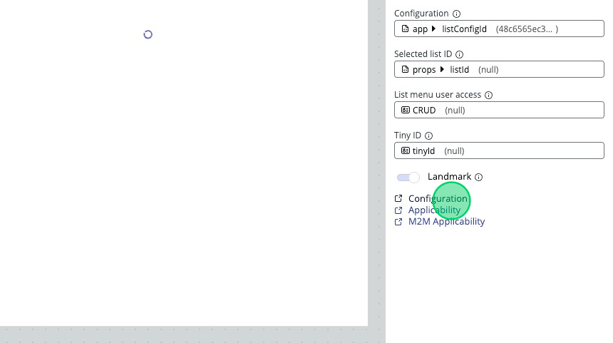

13. Select the **Default – SOW** record to open the list configuration for this workspace. 
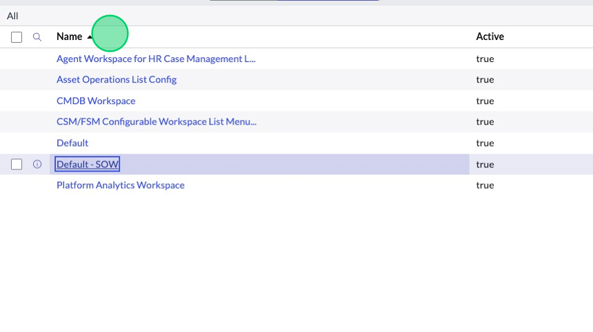