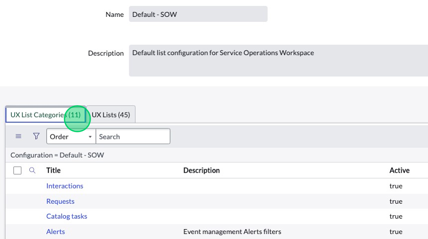
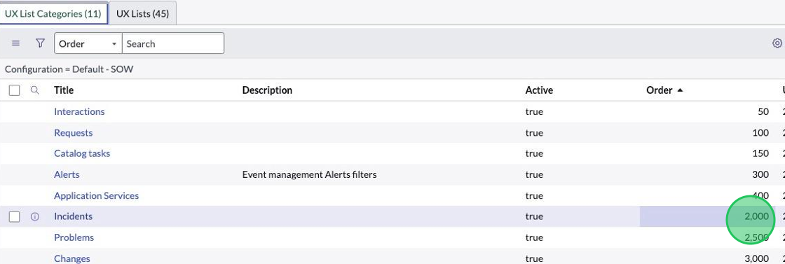
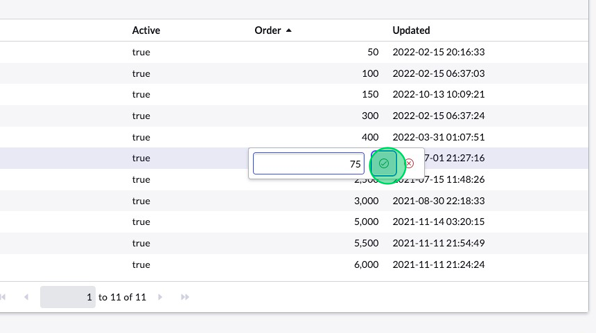
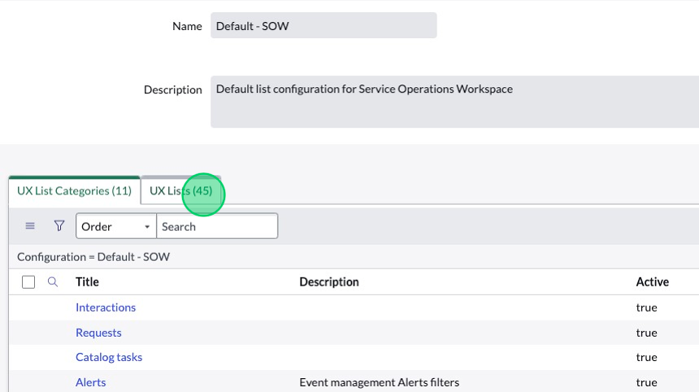
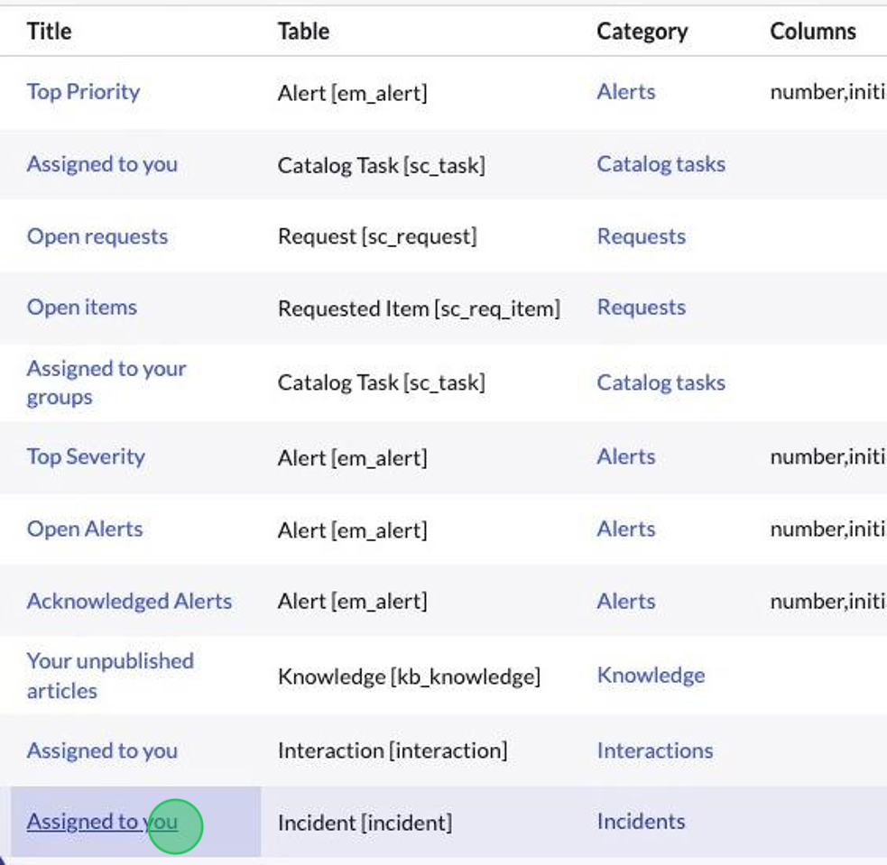
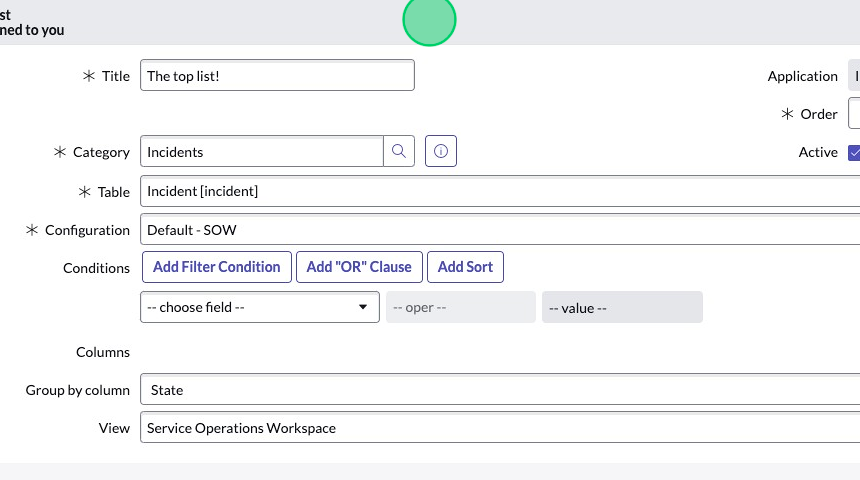
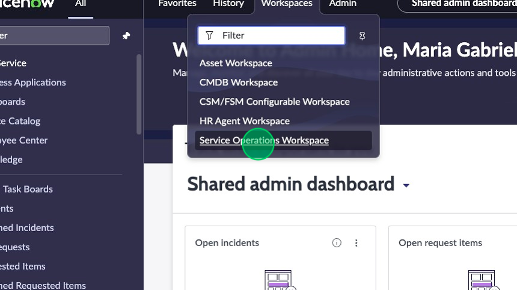
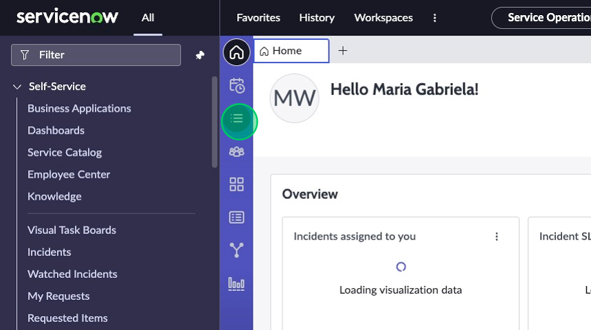
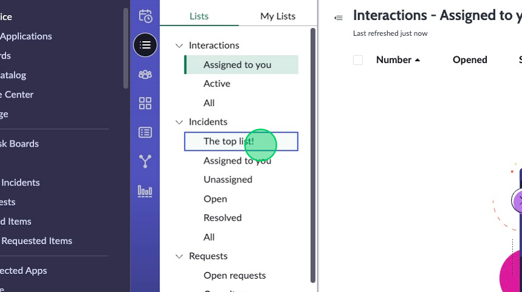

## Overview
In this activity, you will update the UX List Categories and UX Lists for the Service Operations Workspace. 

## Instructions

1. In the related lists, you’ll see 9 UX List Categories and the 37 UX Lists. We can see the order of the Categories by looking at the Order column.  First, let’s focus on reordering the categories so that “Incidents” falls between “Interactions” and “Requests”.  

2. From the list, double-click on the “Order” field for the **Incidents** record. 

3. Type “75” and save by clicking the checkbox or hitting “enter”. This will cause it to land just below Interactions but above Requests. 

4. Click on the **UX Lists** related list tab.

5. Find the `Assigned to you` record that corresponds with the `Incident` table and click on it.

6. Adjust the fields in the form as follows:
   1. **Title**: The top list!
   2. **Order**: 50
   3. **Group by column**: State
   4. **View**: Service Operations Workspace
   5. Remove the filter conditions by clicking the red **[X]** icons.

7. The "List Feature Flags" allow you to customize configurations for the individual list you are adding to the menu. Check the following boxes to fulfill the customer's requirements:
   1. Click the box next to "Show checkboxes on hover".
   2. Click the box next to "Hide column grouping".
   3. Click the box next to "Hide reference links".
   4. Click the box next to "Hide drag and drop".
   5. Click the box next to "Hide pagination"
8. Right-click the header and click **Save**. 
9.	Now navigate back to the Service Operations Workspace and check out your changes. Confirm everything looks just dandy. You might need to hard refresh your browser tab to see the changes take effect.

