## Overview
In this activity, you will add a menu item to the plus menu in the Service Operations Workspace.

## Instructions

1. Starting in the UI Builder home page, search for and click on **Service Operations Workspace** in the Experiences list.
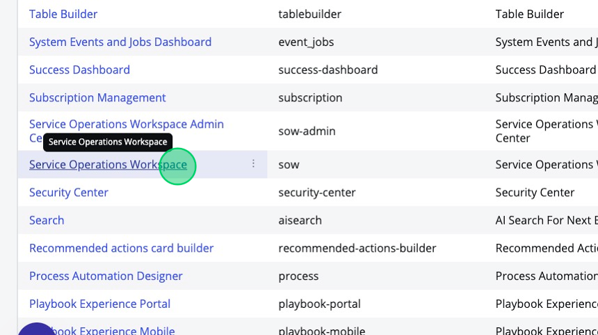

2. In the top right corner click **View experience settings**.
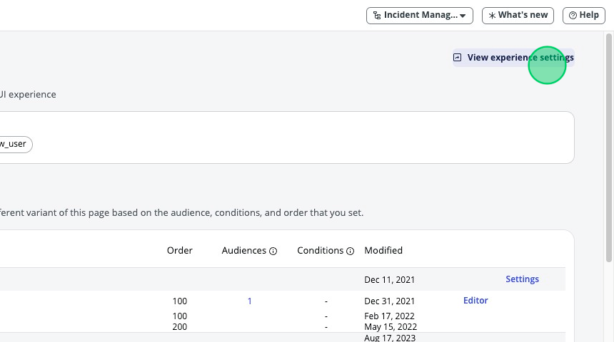

3. Under "Description", click on **Advanced settings**.
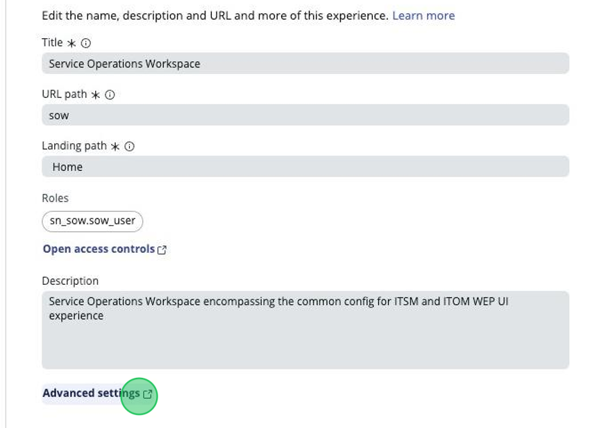

4. Click on the update set picker in the top right corner and select the **Service Operations Workspace Core** application scope. 
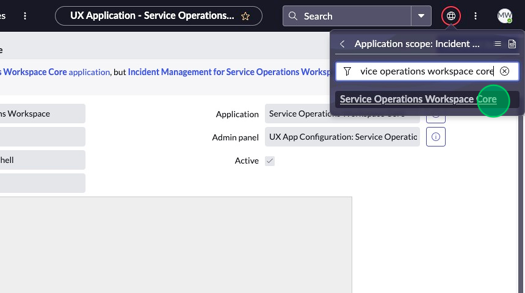

5. Scroll down to the Related Lists.
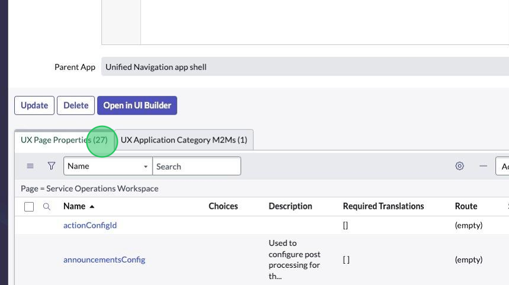

6. In the "UX Page Properties" related list, find the **chrome_tab** record and click on it.
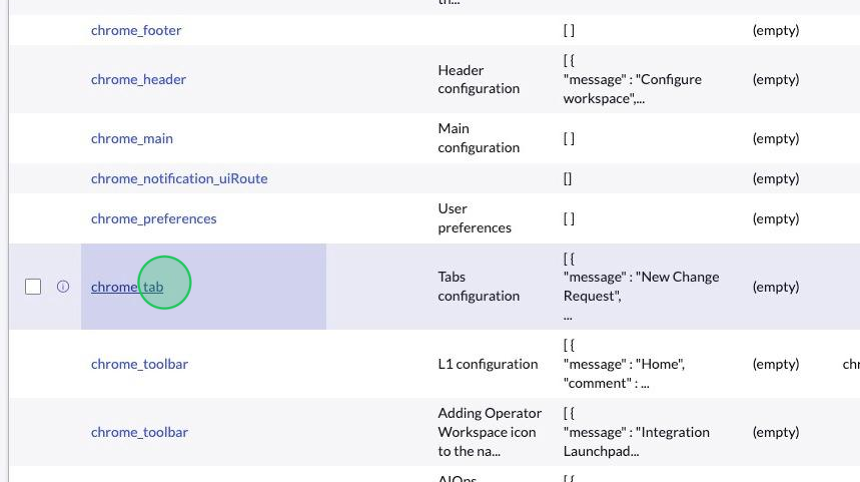

7. This is the configuration for the plus menu. Replace the JSON in the **Value** field with what is provided here:
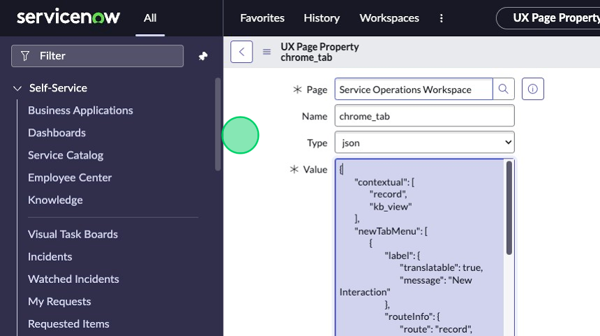

```
{
	"contextual": [
		"record",
		"kb_view"
	],
	"newTabMenu": [
		{
			"label": {
				"translatable": true,
				"message": "New Interaction"
			},
			"routeInfo": {
				"route": "record",
				"fields": {
					"table": "interaction",
					"sysId": "-1"
				},
				"multiInstField": "sysId"
			},
			"condition": {
				"tableDescription": {
					"table": "interaction",
					"canCreate": true
				}
			}
		},
		{
			"label": {
				"translatable": true,
				"message": "New Incident"
			},
			"routeInfo": {
				"route": "record",
				"fields": {
					"table": "incident",
					"sysId": "-1"
				},
				"multiInstField": "sysId"
			},
			"condition": {
				"tableDescription": {
					"table": "incident",
					"canCreate": true
				}
			}
		},
		{
			"label": {
				"translatable": true,
				"message": "New Change Request"
			},
			"routeInfo": {
				"route": "create-change-request-page",
				"fields": {},
				"multiInstField": ""
			},
			"condition": {
				"tableDescription": {
					"table": "change_request",
					"canCreate": true
				}
			}
		},
{
			"label": {
				"translatable": true,
				"message": "New Knowledge Article"
			},
			"routeInfo": {
				"route": "record",
				"fields": {
					"table": "kb_knowledge",
					"sysId": "-1"
				},
				"multiInstField": "sysId"
			},
			"condition": {
				"tableDescription": {
					"table": "kb_knowledge",
					"canCreate": true
				}
			}
		}
	],		
	"maxMainTabLimit": 10,
	"maxTotalSubTabLimit": 30
}
```

Here are the descriptions of some of the JSON properties listed above:

- `message`: This is the text shown to the end user in the option when you click the plus menu.
- `routeInfo`: This is what tells the button what to do. 
	> `route` is the page ID.
	>
	> `fields` contains the URL parameters to be fed to the page when it's opened.
8. Click **Update**.
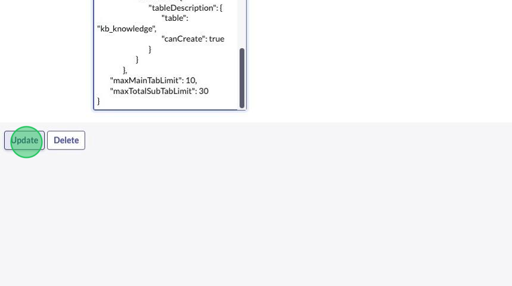

9.  Navigate back to the Service Operations Workspace and test by refreshing the page. If the menu won't load, triple check whether your JSON is appropriately formatted and try again.
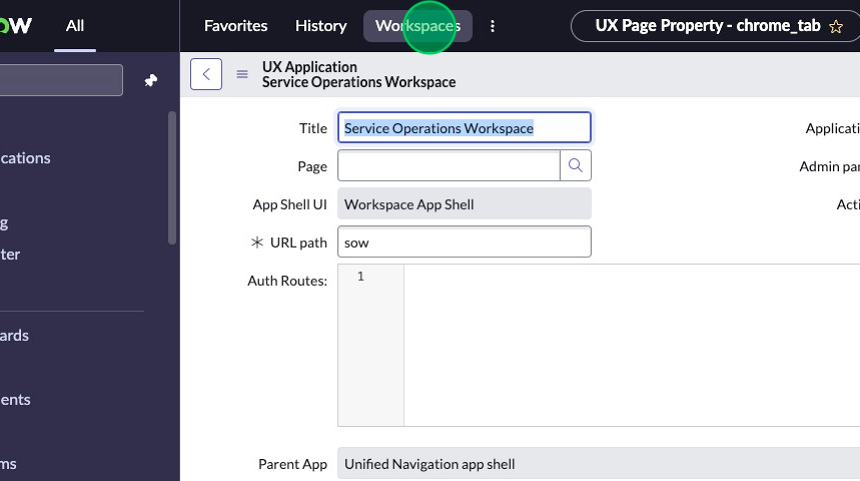
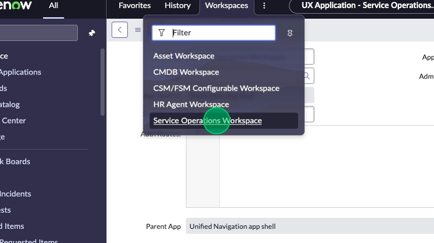

10. Click the **Plus menu**.
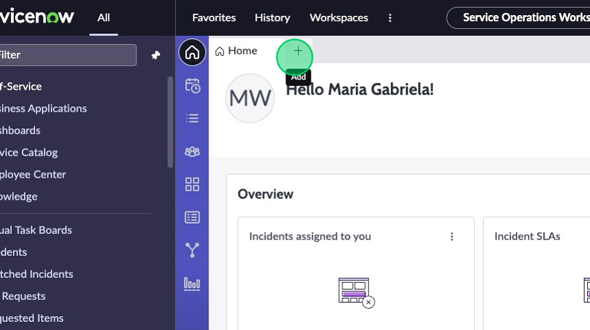

11. Select your newly created option, **New Knowledge Article**.
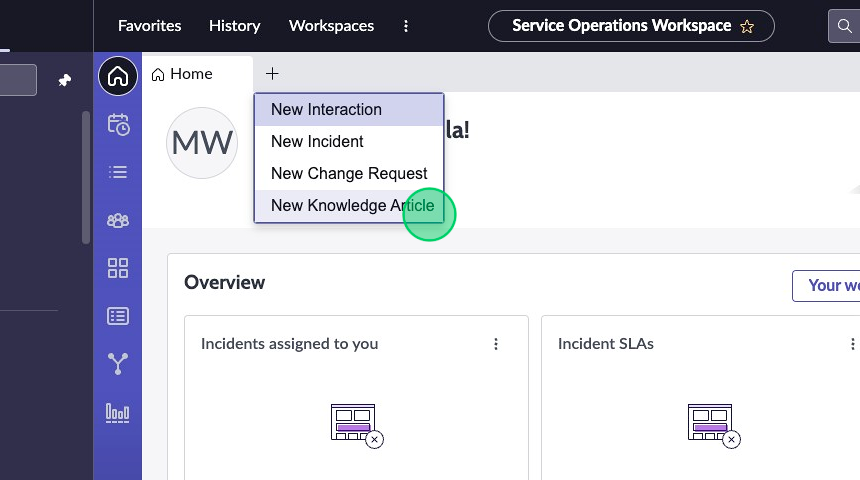

12. The "Create New Knowledge" record page should greet you.
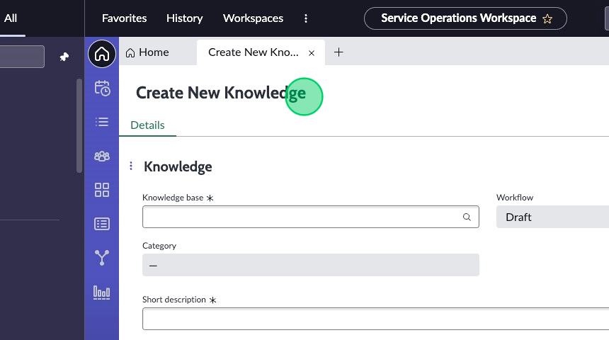