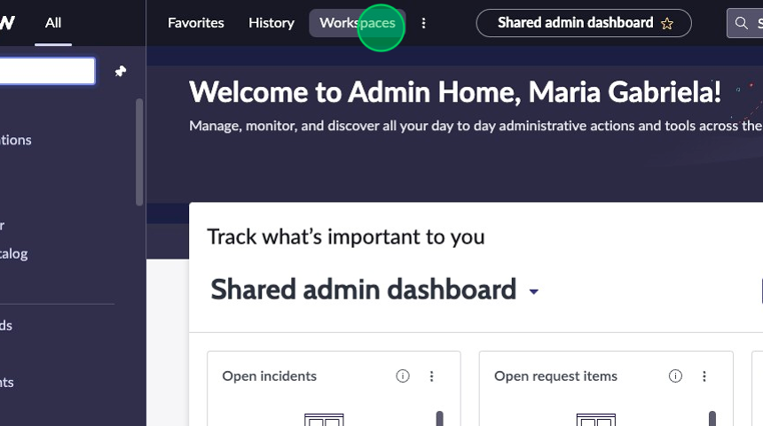

## Overview
In this activity, you will filter the List page of the incidents table and find the record we will be referencing in this exercise.

## Instructions

1. Click on the **Workspaces** menu item.

2. Select the **Service Operations Workspace** option.

3. Click on the **list icon** in the L1 menu on the left (if not there already).

4. Click on the **All** list under "Incidents" in the list menu. 

5. Click on the three dot menu next to the “Number” column header on the list to open the column filtering popover. This defaults to a “contains” operator. 

6. Type “INC0000050” into the text field. 

7. Click **Apply** to apply the filter to the list to find the incident record.

8. Open the incident by selecting the **record number**.

9.  Click on the **Details** tab to view the form.

10. Click on the **Avatar Menu** in the top right corner to access configuration options.

11. Expand “Configure page” by pressing the **down arrow**.
:::info
If you don't see "Configure page", try refreshing your browser.
:::

12.  Select the **Form Layout** option to open the form configuration in a new browser tab. 

13.	Click **Try form builder**.
